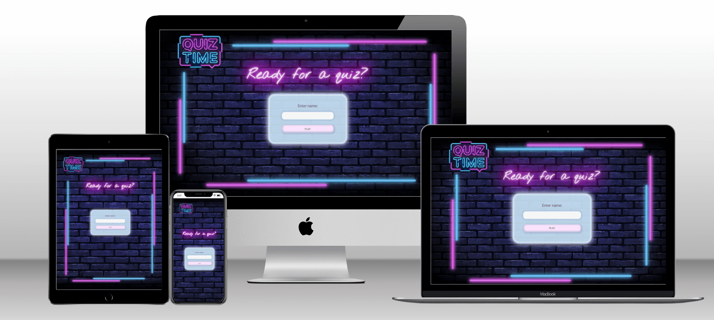
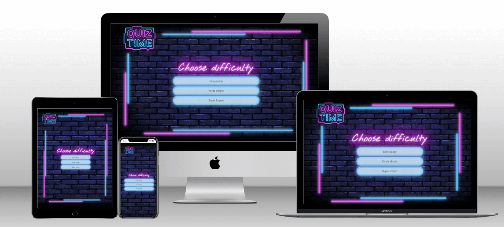
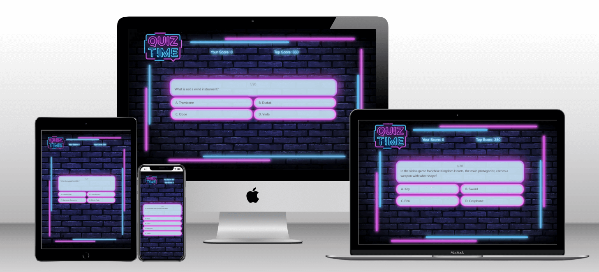
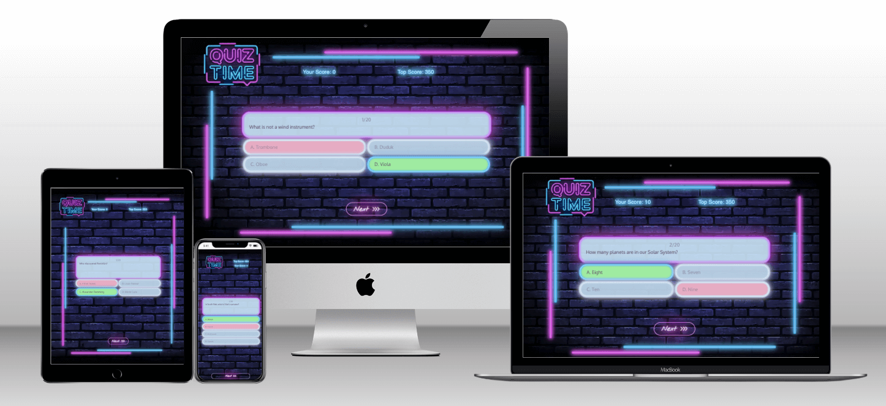
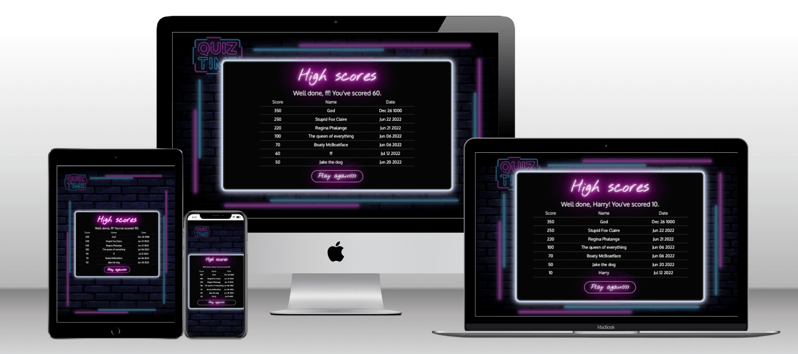
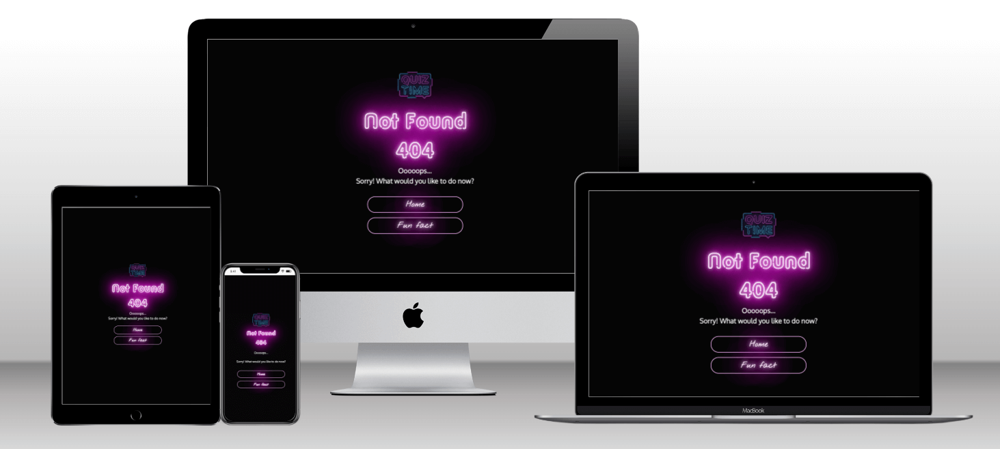
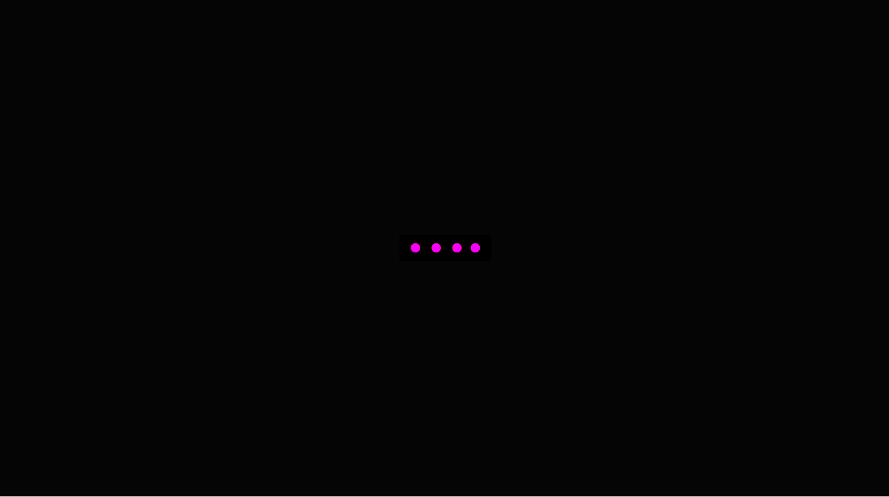
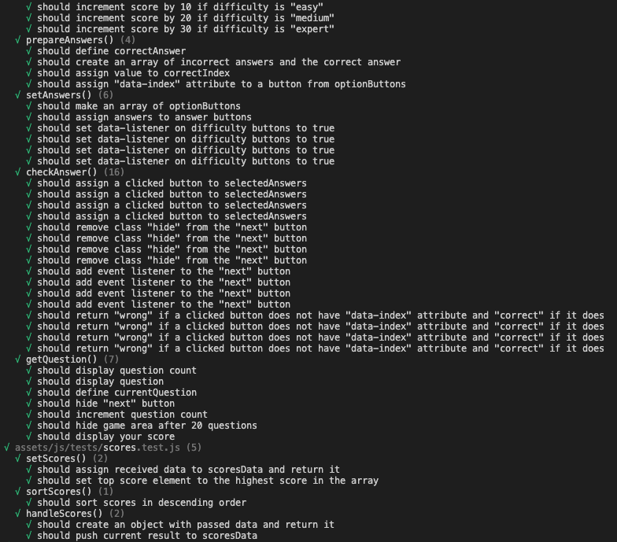

# Quiz Time (JavaScript Game)

# Purpose
This project is a dynamic website - trivia quiz [Quiz Time](https://oks-erm.github.io/quiz-time/). The game provides different levels of difficulty and includes a random fun fact feature between games. The game fetches data from external APIs and provides a variety of questions and facts, thefore it keeps the player amused for multiple game sessions.
The games stores data about all game, this way providing a real competition between all the players over time. 

The core purposes of the website:
- entertain players with a trivia quiz.
- educate via facts after a game session.
- provide real competition.  

The website is built using HTML,CSS,JavaScript and Google Apps Script as a Milestone Project#2 for the Code Institute's Full Stack Developer course.  

[The live website is available here]( https://oks-erm.github.io/quiz-time/)
___
# UX Design
## User stories
### As a **first time user**

- I want to easily understand the main purpose of the site and how to use it.
- I want to be able to easily play the game.
- I want to be able to easily navigate.
- I want to be amused.

### As a **returning** and a **frequent user**

- I want to have different questions without repetitions.
- I want to have a choice of difficulty to be able to progress.
- I want to play multiple games.
- I want to compare my results with other players to see how I am performing.

### All users want to be able to access and comfortably view the website on mobile devices.

___
## Structure
### Home Page
- Helps the user to understand what kind of the game it is.
- Invites to enter name and start the game.
- Grabs the user's attention and grips it with bold design.
    #### User Goal:
    >   - Understand the main purpose of the website.
    >   - Easily navigate and interact with the website.
    >   - Be amused.
    #### Website Goal:
    >   - Interest and engage the user.

### Game Page
- Allows to choose difficulty level.
- Allows to play the game.
- Displays highscores in the end of the game.
    #### User Goal:
    >   - Take a quiz.
    >   - Be amused.
    >   - Compare their result with other players.
    #### Website Goal:
    >   - Entertain the user with the quiz.
    >   - Initiate future engagement, such as returning to beat the top score or make sure nobody has beaten yours.

### Funfact Page
- Provides a random interesting fact to entertain the user and extend their knowledge.
- Offer scenarios of further actions, such as "play again" or "change name and play again".
- For the first time player this page is a suprprise.
    #### User Goal:
    >   - Be amused.
    >   - Choose the way to continue playing.
    #### Website Goal:
    >   - Entertain and educate the user.
    >   - Offer further engagement.

### Error Pages (404, 500)
- Informs the user about a broblem occured and offer further actions to keep the user on the website.
    #### User Goal:
    >   - Understand what to do in case of an error.
    #### Website Goal:
    >   - Keep the user on the website.
    >   - Make an unpleasant event of getting an error fun for the user.
___
## Wireframes
.
.
.
.
.

## Design

The project's design springs from the easthetics of gaming machines and [God's Own Junkyard](https://www.godsownjunkyard.co.uk/) art space. One of the reasons is that setting a quiz in more obvious pub settings seemed not acceptable for some groups of potential players. A pub setting does not seem very appropriate for younger players, religious and ethnic groups, whose customs disaprove of alcohol and pubs by assosiation. To make it apealing for broader audience a more neutral solution was opted for. 

### Colour Scheme

Colour scheme is inspired by neon signs and neon glowing effects are used throughout the website. Shades of magenta and blue are bold and cheerful balanced out with deep black-blue and pastel light blue and grey. 

#### **Cultured White** 
#f8f8f8 - is used for neon glow effect and spreading light effect.

#### **Beau Blue** 
#B9D3E8 - is used for background in the blocks with text content.

#### **Capri Blue** 
#45C0FD - is used for neon glow effect and spreading light effect.

#### **Magenta**  
#FF00FE - is used for neon glow effect, animated glowing, spreading light effect and glowing headings.

#### **Space Cadet**  
#181B3B - is used for shadows and typography.

#### **Rich Black**  
#181B3B - is used for background, background merging with background image and shadows.

### Typography

[Nothing You Could Do](https://fonts.google.com/specimen/Nothing+You+Could+Do?query=nothing+you) is used for headings. It is nonchalant, whilst legible, works well with glowing effect.

[Oxygen](https://fonts.google.com/specimen/Oxygen?query=oxygen) was chosen for body text. It is neutral, soft and easy to read even on the smaller screens.

[God's own junkyard](https://allbestfonts.com/gods-own-junkyard-pro/) is used for the Fun Fact page, as this page is a surprise for the first time user it was decided to use slightly different styling for it. As the page has a plenty of free space, I found it to be a great opportunity to implement the most stereotypical neon font for aesthetic purpose, as it looks good only in bigger sizes.

### Images

The images in this project were sourced from [ShutterStock](https://www.shutterstock.com/). They were specifically selected to set up the vibe of the website and increase the aesthetic impact of the design.

### Visual Effects

#### Shadows
As the Home Page consists of the form with two input elements: a text field and a submit button. It was important to add volume and make them more appealing to engage, especially with such a bold and vibrant surroundings with plenty of neon glowing. 

#### Logo and Page Headings Gradient
Logo was sourced from a shutterstock image, edited by me to maintain the colour palette. Also it inspired the CSS neon frame. 

#### Neon frame
Initially the neon frame was a part of the background image, but it turned out to be a poor solution considering the required responsiveness. So the adaptive neon frame was implemented. Neon glowing effect was immitated by multiple shadows in CSS and the frame was established with a grid.  

#### Buttons and Hover Effects
There are two types of buttons: game buttons and navigation buttons. 
Game buttons offer hover over effect: it changes inset shadow colour to invite the user to engage and demonstrate that the elements are interactive.
Navigation buttons have subtle glowing animation at all times, as well as changing colour when being hoved over with the mouse.

#### Animated glowing
Animated glowing pulsating effect is used for headings and navigation buttons to create the neon aesthetics. The glowing is very subtle, so it does not compromise legibility. Keeping in mind that it might cause accessibility issues, the website includes a media query for people who prefer reduced motion. 

#### Loader
All pages are fitted with loaders(magenta dots on black background), because at many points the website interracts with external APIs and awaits for the data, which might take some time, it was decided to implement a loader to inform the user that something is in progress and the website is not broken. Moreover the slow fadeout effect provides a smooth aesthetical transition between pages even if we do not happen to see the loader running. 

#### Confetti burst
When the highscores modal appears it is celebrated with a confetti burst created with [Confetti](https://www.npmjs.com/package/canvas-confetti) JS library. 

#### Increment Score animation
When the score increments it is accompanied with a little burst of particles around the changing number. The effect is created with [Mo JS](https://mojs.github.io/) JS library.

#### Cursor
For all elements that can be clicked a custom cursor appears when being hovered over with the mouse.
___

# Features
## Existing Features
- **Input Form (Home Page)**

!

The game starts with a simple home page, it invites the user to enter a name and start the game. A type of the game is clear from the name, so additional explanations are not needed. It includes the Logo (which is a link to the Home page). From any point of the website the user can go back to the Home page.

- **Difficulty Area**

This section is the first thing the user sees starting the game, it allows to choose difficulty level of the quiz. It maintaines the same layout and design as the Home Page.

- **Question Area**

The question area is the main area of the game. On the top there are the Current Score (which increments according to the difficulty) and the Top Score (that is fetched from the API that stores results of all the games ever played by all users). It displays 20 questions from the API according to the chosen difficulty. API includes thousands of questions, this way repetitions are very rear and the game is gripping and users might be tempted to play multiple games and return again. The user chooses the answer and receives a clear colour coded response if the answer is correct. The navigation is clear because the game is linear.

- **Highscores Modal**

In the end of the game the highscores modal window appears. It displays the player's current result and top 8 results for all the history of the game. At the bottom of the window there is a button "Play again".

- **Funfact Page**

This page is a secret page which appears after the game when the user clicks "Play again", it is intended to be a reward after the game and there is no way to get to this page. It displays a random fun fact from the API, facts are brief and interesting, I believe everyone who loves quizes would appreciate this little treat. This page offers the user possible scenarious: play again (navigates to the difficulty section) or change name (if the user decides to contribute to the fun names collection) and play again (navigates to the home page).

- **Error Pages**

Error pages inform the user that something went wrong without giving the impession that the user has left the website, they offer alternative scenarious keeping the user on the website.

- **Loader**

The loader signals to the user that something is happening.

## Responsive layout

The site is designed to be flexible, fluid, responsive and aesthetically enjoyable on all screen sizes and resolutions starting from 375px (based on [statistics for 2022](https://worship.agency/wp-content/uploads/2022/01/mobile-screen-sizes-2022.png)). To ensure better visual experience on mobile devices, the neon frame is turned off for the mobile version. To provide better user experince the landscape orientation for mobile devices was disabled - if the user attempts rotating a device, the game displays a message and offers to rotate the device back to continue the game. This feature was implemented because in the landscape orientation it was not possible to fit all elements of the game into one screen and it included a lot of unnecessary scrolling. 

The choice of breakpoints was based on different aspects, such as typical devices' screen sizes and the intention to provide the best possible presentation of the content for all screen sizes. 768px breakpoint is meant to hit the iPad mini; 992px is quite common to signify the transition to laptops, and, content-wise, it proved to be reasonable. 1446px is not a typical choice, but it was preferred based on the content layout. The way I see quiz games, they are supposed to be played on bigger screens, as it is easier to read, possibly with a group of people.

The main game frame is based Grid, with Flex used for the content inside the grid, what allows the website to expand and shrink responsively to a device screen size providing each page's design integrity. Elements must maintain their respective position (or change if intended for better user experience), they do not overlap or misalign, and the content does not overflow. 

## Feature Considerations

### Miltiplayer

### Select the ammount of questions

### Statistics of correct answers for each question
It could be interesting to keep track of statistics for each question, such as how many people answered it and the percentage of correct answers.

### Easter eggs
I personally enjoy unexpected and fun featured so I would like to come up with something that would be entertaining without breaking the flow of the game.

___

# Technologies
## Languages
- HTML, CSS, JavaScript
## Programs, frameworks, libraries
- [Gitpod](https://gitpod.io/) IDE to develop the website.
- [GitHub](https://GitHub.com/) to host the source code and GitHub Pages to deploy and host the live site.
- Git to provide version control (to commit and push code to the repository). 
- [Google Spreadsheets API](https://developers.google.com/sheets/api) to store scores data.
- [Google Apps Script](https://developers.google.com/apps-script) to write an app to process requests to Spreadsheets.
- [jQuery](https://jquery.com/)(JS library) for additional functionality.
- [Confetti](https://www.npmjs.com/package/canvas-confetti)(JS library) to create a burst of confetti animation. 
- [Mo JS](https://mojs.github.io/)(JS library) to create particles animation.
- [Google Fonts](https://fonts.google.com/) for typography.
- [Google Chrome Dev Tools](https://developers.google.com/web/tools/chrome-devtools) for debugging, inspecting pages' elements and testing layout.
- [Open Trivia DataBase](https://opentdb.com/) - API used for the trivia questions.
- [Random Fact Database](https://uselessfacts.jsph.pl/) - API used for the facts for the Fun Fact page.
- [Vitest](https://vitest.dev/) for unit testing.
- [TinyJPG](https://tinyjpg.com/) to optimise images for readme. 
- [Favicon.io](https://www.favicon.io/) to create the website favicon.
- [Coolors](https://coolors.co/image-picker) to source colour palette from image.
- [Balsamiq](https://balsamiq.com/wireframes/) to design wireframes.
- [Techsini](https://tecnisih.com) to create the Mockup image in this README.
- Google Chrome's [Lighthouse](https://developers.google.com/web/tools/lighthouse) to assess accessibility.
- [Screen Reader for Google Chrome](https://chrome.google.com/webstore/detail/screen-reader-for-google/nddfhonnmhcldcbmhbdldfpkbfpgjoeh/related?hl=en) to assess screen-reader accessibility.
- [Web Disability Simulator](https://chrome.google.com/webstore/detail/web-disability-simulator/olioanlbgbpmdlgjnnampnnlohigkjla) to view the site as people with accessibility needs would see it.
- Toptal [Colorfilter](https://www.toptal.com/designers/colorfilter/) to assess colour-blind accessibility.
- [W3C HTML Markup Validator](https://validator.w3.org/) to validate HTML code.
- [W3C Jigsaw CSS Validator](https://jigsaw.w3.org/css-validator/) to validate CSS code.
- [Markdown Tables Generator](https://www.tablesgenerator.com/) to generate tables for the readme file.
- Code Institute's Gitpod Template to generate the workspace for the project.
___

# Deployment

This project was deployed to GitHub pages. The steps to deploy are as follows:

1. Log into GitHub.
2. Select `quiz-time` from the list of repositories.
3. Select `Settings` From the Repositories sub-headings.
4. In the left side menu select `Pages` from `Code and automation` section.
5. Under the `Source` heading in the dropdown menu select `main`.
6. A second drop-down menu should remain with the default value `/(root)`.
7. Press `Save`.
8. A message that the website is ready to be deployed will appear, refresh the page and the link to the deployed site will be available in a green sub-section on the top of the page.
9. Click on the link to go to the live deployed page.

The live link can be found [here](https://oks-erm.github.io/quiz-time).

## How to run this project Locally

- **Clone the repository**
1. Navigate to the GitHub Repository `oks-erm/quiz-time`.
2. Click the `Code` drop-down menu.
3. Click the `HTTPS` sub-heading under the `Clone` heading.
4. Copy the link.
5. Open an IDE of your choice (VSCode, Atom, Komodo, etc).
6. Open a terminal in the directory of your choice, type `git clone` and paste the link.
7. A clone of the repository will now be created on your machine.

- **Download the repository manually**
1. Navigate to the GitHub Repository `oks-erm/quiz-time`.
2. Click the `Code` drop-down menu.
3. Click `Download ZIP`.
4. Locate the ZIP file and extract it to a folder where you want the repository to be stored. 
5. Open an IDE of your choice (VSCode, Atom, Komodo, etc).
6. Navigate to the directory where the repository was extracted.
7. Now you will have the contents of the project available offline on your machine.
___

# Testing

## User Story Testing
| Expectations                                                                                 | Realisation                                                                                                                                                                                                                                                                                                                                                                                                                          |
|----------------------------------------------------------------------------------------------|--------------------------------------------------------------------------------------------------------------------------------------------------------------------------------------------------------------------------------------------------------------------------------------------------------------------------------------------------------------------------------------------------------------------------------------|
| **As a first time user:**                                                                    |                                                                                                                                                                                                                                                                                                                                                                                                                                      |
| I want to easily understand the main purpose of the site and how to use it. | 1. On the Home Page, the user is presented with a logo,  explaining the type of the game rules of which are clear from the name.  2. The user is invited to enter a name and start the game. It is clear what to do and there are no distracting elements. |
| I want to be able to easily play the game.                                | 1. The game flow is linear, headings include  instructions and calls to action and buttons   clearly guide the user through the game.                                                                                                                                                                                                                                  |
| I want to be able to easily navigate.   | 1. Navigation is simple: the buttons are clearly seen and there are never more than 2 options to choose from.  2. From any point of the game the player can return back to the Home Page.                       |
| I want to be amused.                                                                         | 1. Neon vibe.  2. Variety of questions that don't repeat.  3. A surprise page Fun Fact, where the user can learn something new in a few soconds. If you like quizes, you would love learning something new.                                                                                                                                                 |
| **As a returning and frequent user:**                                                        |                                                                                                                                                                                                                                                                                                                                                                                                                                      |
| I want to have different questions without repetitions.                       | 1. The questions are taken from the API with thousands of questions, so repetitions are extremely rare.                                                                                                                                                                            |
| I want to have a choice of difficulty to be able to progress.                  | 1. There are 3 levels of difficulty to provide different players with appropriate level or allow progress.                                                                                                                                                                                                                                                    |
| I want to play multiple games.                                                               | 1. The game flow is circled, the user will always be offered one more game.  2. With variety of questions the user will not get bored too soon.                                                                                                                                                                     |
| I want to compare my results with other players to see how I am performing.   | 1. The Highscores modal displays the player's current result, so the player can compare their result with the top scores.  2. The user can see results of all the games ever played so they are motivated to play again  to get into the top or beat the high score.                                                                                                                                                                                                                               |
| **All users:**                                                                               |                                                                                                                                                                                                                                                                                                                                                                                                                                      |
| All users want to be able to access and comfortably  view the website on mobile devices.            | 1. The website is fully responsive on all screen sizes and  resolutions starting from 375px.  2. The mobile version has different layout to ensure that mobile users receive quality experience.                                                                                |

## Manual Testing

Design was tested manually in three browsers: 
- Chrome, 
- Firefox
- Safari 

on multiple devices: 
- mobile devices
    - iPhone 12,
    - iPhone XR,
    - Samsung Galaxy S20
- tablets
    - iPad Air
- laptops
    - MacBook Air 13',
    - MacBook Pro 16',
    +  +desktop screen 24'

Certain minor differences were detected, but no issues affecting the overall performance.

### Bugs detected:
For one of the Android devices the website was flickering with all the screen instead of css animation. I was not able to approach it, because I was not able to replicate it on my devices.

## Feature Testing

Feature testing was performed through automated unit testing using Vitest.
To run the tests: install dependencies (`npm install`) and use a command `npm test` in terminal. 

Find the screenshots below:

## Automated Testing

1. **[W3 Markup Validation](https://validator.w3.org/) - HTML Validation**

All pages were run through HTML Validator. No errors were detected.

2. **[W3 Jigsaw](https://jigsaw.w3.org/css-validator/) - CSS Validation**

CSS Stylesheet was run through CSS Validator. No errors were detected.

Warning: auto is not defined by any specification as an allowed value for pointer-events, but is supported in multiple browsers.

3. **[JS Hint](https://jshint.com/)**

4. **[Google Lighthouse](https://developers.google.com/web/tools/lighthouse)**

**Home Page**

Mobile

Desktop

**Philosofy Page**

Mobile

Desktop

**Meetups Page**

Mobile

Desktop

**Signup Page**

Mobile

Desktop

## Accessibility Testing

### Screen Reader for Goggle Chrome

The website was tested with [Screen Reader for Goggle Chrome](https://chrome.google.com/webstore/detail/screen-reader/kgejglhpjiefppelpmljglcjbhoiplfn?hl=en). No issues arose. 

### Toptal Colorfilter

The website was tested with Toptal [Colorfilter](https://www.toptal.com/designers/colorfilter/) to make sure it is accessible for colour-blind users. No accessibility issues were detected.

[Result preview 1](https://www.toptal.com/designers/colorfilter?orig_uri=https://oks-erm.github.io/sofing/index.html&process_type=protan)

[Result preview 2](https://www.toptal.com/designers/colorfilter?orig_uri=https://oks-erm.github.io/sofing/index.html&process_type=deutan)

[Result preview 3](https://www.toptal.com/designers/colorfilter?orig_uri=https://oks-erm.github.io/sofing/index.html&process_type=tritan)

[Result preview 4](https://www.toptal.com/designers/colorfilter?orig_uri=https://oks-erm.github.io/sofing/index.html&process_type=grey)

However, a layout bug was found, which did not appear at any other stage.

## Detected Issues and Resolutions